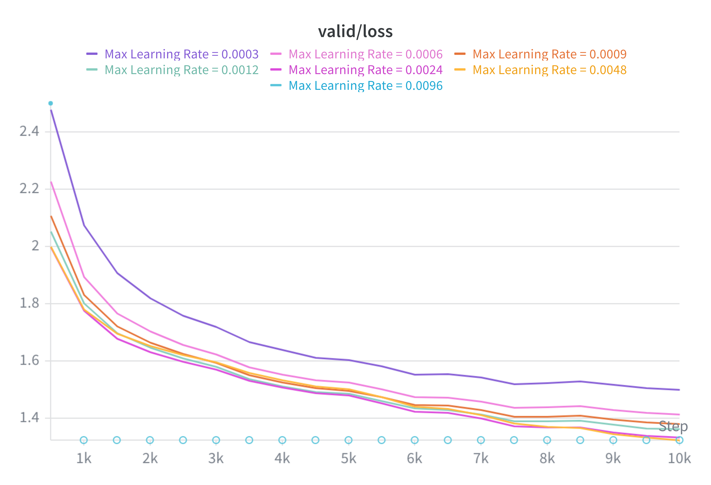
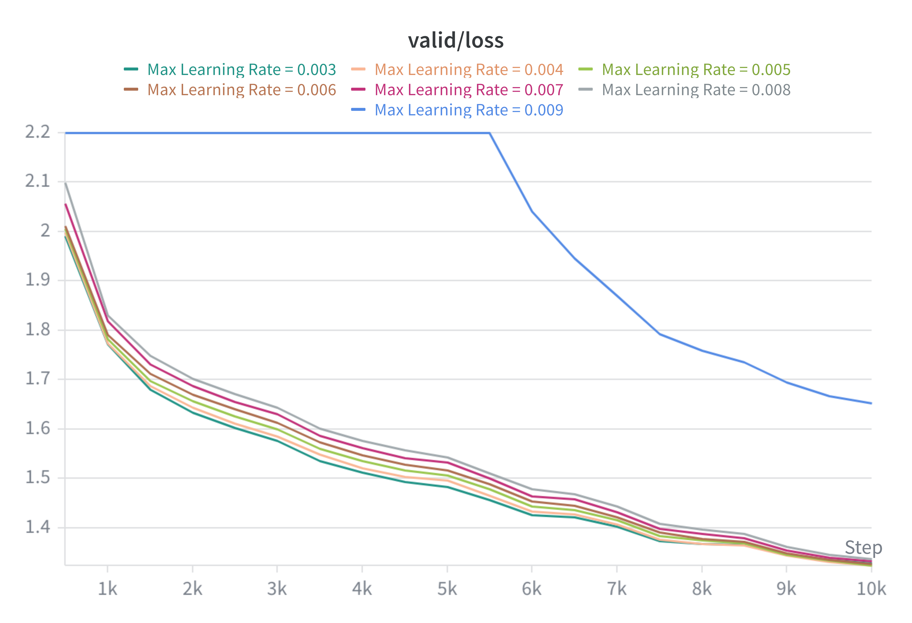
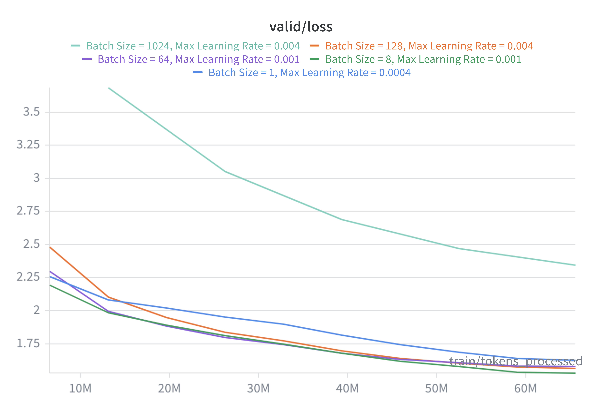
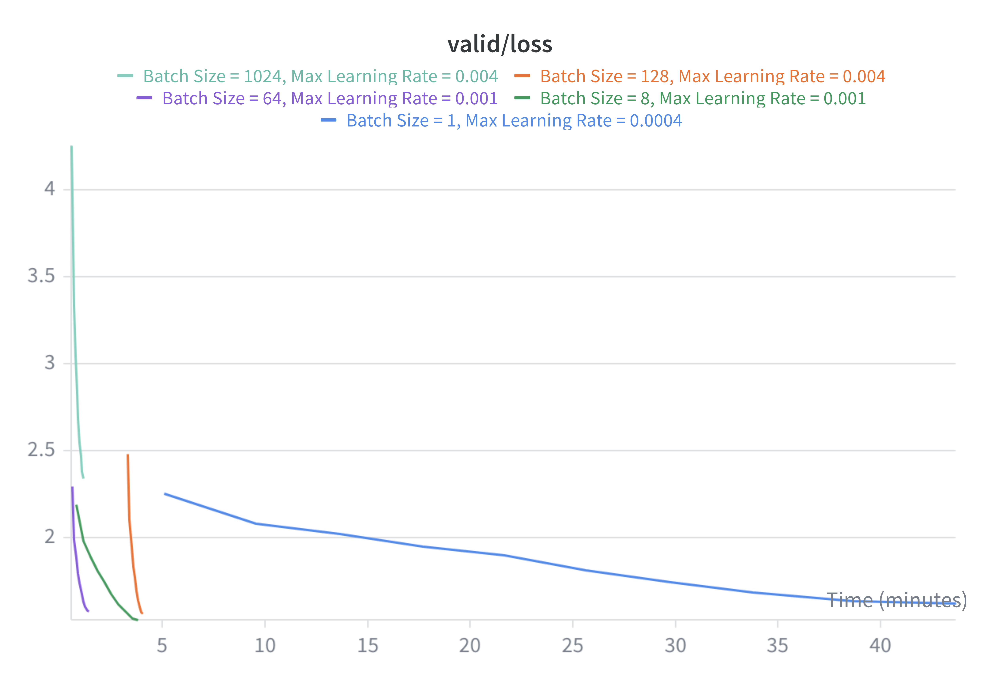

# CS336 Spring 2025 Assignment 1: Basics

For a full description of the assignment, see the assignment handout at
[cs336_assignment1_basics.pdf](./cs336_assignment1_basics.pdf)

If you see any issues with the assignment handout or code, please feel free to
raise a GitHub issue or open a pull request with a fix.

## Setup

### Environment
We manage our environments with `uv` to ensure reproducibility, portability, and ease of use.
Install `uv` [here](https://github.com/astral-sh/uv#installation) (recommended), or run `pip install uv`/`brew install uv`.
We recommend reading a bit about managing projects in `uv` [here](https://docs.astral.sh/uv/guides/projects/#managing-dependencies) (you will not regret it!).

You can now run any code in the repo using
```sh
uv run <python_file_path>
```
and the environment will be automatically solved and activated when necessary.

### Run unit tests


```sh
uv run pytest
```

Initially, all tests should fail with `NotImplementedError`s.
To connect your implementation to the tests, complete the
functions in [./tests/adapters.py](./tests/adapters.py).

### Download data
Download the TinyStories data and a subsample of OpenWebText

``` sh
mkdir -p data
cd data

wget https://huggingface.co/datasets/roneneldan/TinyStories/resolve/main/TinyStoriesV2-GPT4-train.txt
wget https://huggingface.co/datasets/roneneldan/TinyStories/resolve/main/TinyStoriesV2-GPT4-valid.txt

wget https://huggingface.co/datasets/stanford-cs336/owt-sample/resolve/main/owt_train.txt.gz
gunzip owt_train.txt.gz
wget https://huggingface.co/datasets/stanford-cs336/owt-sample/resolve/main/owt_valid.txt.gz
gunzip owt_valid.txt.gz

cd ..
```

## Answers to questions

### `unicode1`

#### (a) What Unicode character does `chr(0)` return?

It returns the null character `'\x00'`.

#### (b) How does this character’s string representation (`__repr__()`) differ from its printed representation?

The string representation of the character by itself is `'\\x00'`.

#### (c) What happens when this character occurs in text?

In text, the character is stored as `\x00`, but in the text's string representation the character is not shown at all.  However, the character is still present as is demonstrated by measuring the length of the string.

### `unicode2`

#### (a) What are some reasons to prefer training our tokenizer on UTF-8 encoded bytes, rather than UTF-16 or UTF-32? It may be helpful to compare the output of these encodings for various input strings.

UTF-16 and UTF-32 encodings are much longer, so less text will fit into a transformer's context window.  In addition, because UTF-32 is fixed-length, it contains a lot of zeros that contain no semantic meaning but take up the transformer's context window.

#### (b) Consider the following (incorrect) function, which is intended to decode a UTF-8 byte string into a Unicode string. Why is this function incorrect? Provide an example of an input byte string that yields incorrect results.
```
def decode_utf8_bytes_to_str_wrong(bytestring: bytes):
    return "".join([bytes([b]).decode("utf-8") for b in bytestring])
```

The function is incorrect because often multiple bytes correspond to a single Unicode character.  An example is the character `'牛'`, whose byte string is `b'\xe7\x89\x9b'`.  The first byte `b'\xe7'` cannot be decoded on its own.

#### (c) Give a two-byte sequence that does not decode to any Unicode character(s).

The two-byte sequence `b'\xe7\x89` does not decode to any Unicode character(s), because those are the first two bytes of, for example, the character `'牛'`, whose byte string is `b'\xe7\x89\x9b'`.

### `train_bpe_tinystories`

#### (a) Train a byte-level BPE tokenizer on the TinyStories dataset, using a maximum vocabulary size of 10,000. Make sure to add the TinyStories `<|endoftext|>` special token to the vocabulary. Serialize the resulting vocabulary and merges to disk for further inspection. How much time and memory did training take? What is the longest token in the vocabulary? Does it make sense?

The training took 102.25 seconds and had a peak memory use of 446 MB.  The longest token in the vocabular is ` accomplishment`, which makes sense since it is a relatively common 15-byte string.

#### (b) Profile your code. What part of the tokenizer training process takes the most time?

The pretokenization takes the most time: 94.52 seconds.

### `train_bpe_owt`

#### (a) Train a byte-level BPE tokenizer on the OpenWebText dataset, using a maximum vocabulary size of 32,000. Serialize the resulting vocabulary and merges to disk for further inspection. What is the longest token in the vocabulary? Does it make sense?

The training took 19.49 minutes and had a peak memory use of 7.86 GB.  The longest token is `ÃÂÃÂÃÂÃÂÃÂÃÂÃÂÃÂÃÂÃÂÃÂÃÂÃÂÃÂÃÂÃÂ`, which makes sense since OpenWebText is a much more realistic dataset of text on the web than the curated TinyStories dataset.

#### (b) Compare and contrast the tokenizer that you get training on TinyStories versus OpenWebText.

The vocabulary in the TinyStories tokenizer is highly curated, since the underlying dataset is highly curated.  The words generally correspond to real words.  In contrast, the OpenWebText tokenizer yields a vocabulary that is much less curated, consisting of any conglomerations of characters frequently found on the internet.

### `tokenizer_experiments`

#### (a) Sample 10 documents from TinyStories and OpenWebText. Using your previously-trained TinyStories and OpenWebText tokenizers (10K and 32K vocabulary size, respectively), encode these sampled documents into integer IDs. What is each tokenizer's compression ratio (bytes/token)?
The compression ratio for TinyStories is 4.126 bytes/token, while the compression ratio for OpenWebText is 4.678 bytes/token.

#### (b) What happens if you tokenize your OpenWebText sample with the TinyStories tokenizer? Compare the compression ratio and/or qualitatively describe what happens.
The compression ratio goes down to 3.187 bytes/token, because the TinyStories tokenizer was not specifically created for the OpenWebText dataset, so it is less efficient.

#### (c) Estimate the throughput of your tokenizer (e.g., in bytes/second). How long would it take to tokenize the Pile dataset (825GB of text)?
The throughput for the TinyStories tokenizer is 719235 bytes/second, and the throughput for the OpenWebText tokenizer is 548926 bytes/second.  Tokenizing the Pile dataset would take `825 * 10**9 bytes / (719235 bytes/second) / (60 seconds/minute) / (60 minutes/hour) / (24 hours/day) = 13.28 days` with the TinyStories tokenizer and  `825 * 10**9 bytes / (548926 bytes/second) / (60 seconds/minute) / (60 minutes/hour) / (24 hours/day) = 17.40 days` with the OpenWebText tokenizer.

#### (d) Using your TinyStories and OpenWebText tokenizers, encode the respective training and development datasets into a sequence of integer token IDs. We'll use this later to train our language model. We recommend serializing the token IDs as a NumPy array of datatype `uint16`. Why is `uint16` an appropriate choice?

`uint16` is an appropriate choice because `2**16 = 65536`, so having available integers from `0` to `65535` for tokenization accommodates vocabulary sizes of 10000 (TinyStories) and 32000 (OpenWebText).  Each token then requires just 2 bytes to store.

### `transformer_accounting`

#### (a) Consider a GPT-2 XL-sized model using our assignment architecture, which has the following configuration:

- `vocab_size`: 50,257
- `context_length`: 1,024
- `num_layers`: 48
- `d_model`: 1,600
- `num_heads`: 25
- `d_ff`: 4,288 (the nearest multiple of 64 to 8/3 * 1,600)

#### Suppose we constructed our model using this configuration. How many trainable parameters would our model have? Assuming each parameter is represented using single-precision floating point, how much memory is required to just load this model?

For each `TransformerBlock`, we have:
- `CausalMultiheadSelfAttention`: `4 * d_model ** 2` (queries, keys, values, output)
- `PositionWiseFeedForward`: `3 * d_model * d_ff` (gate, value, final)
- 2 `RMSNorm`: `2 * d_model`

In addition, for the `TransfomerLM`, we also have:
- `Embedding`: `vocab_size * d_model`
- 1 `RMSNorm`: `d_model`
- 1 `Linear`: `vocab_size * d_model`

Putting it all together, the number of trainable parameters is:
`d_model * (2 * vocab_size + 1) + num_layers * d_model * (4 * d_model + 3 * d_ff + 2)`

Plugging in numbers, this is 1,640,452,800 parameters.  If each parameters is 2 bytes, this is 3,280,905,600 bytes, or 3.28 GB.

#### (b) Identify the matrix multiplies required to complete a forward pass of our GPT-2 XL-shaped model. How many FLOPs do these matrix multiplies require in total? Assume that our input sequence has context_length tokens.

For each `TransformerBlock`, we have:
- `CausalMultiheadSelfAttention` has QKV and output projection (`2 * 4 * d_model * d_model * context_length`) and query-key multiply and attention-value multiply (`2 * 2 * context_length * context_length * d_model`).
- `PositionWiseFeedForward` has 3 projections (`2 * 3 * d_model * d_ff * context_length`).

In addition, for the `TransformerLM`, we have:
- 1 `Linear` has a projection (`2 * context_length * d_model * vocab_size`)

Putting it all together, the number of FLOPs required for all of these matrix multiplies is:
`2 * context_length * d_model * (vocab_size + num_layers * (4 * d_model + 2 * context_length + 3 * d_ff))`

Plugging in numbers, this is 3,516,769,894,400 FLOPs, or 3.52 trillion FLOPs.

#### (c) Based on your analysis above, which parts of the model require the most FLOPs?

- LM Head: `2 * context_length * d_model * vocab_size` = 164,682,137,600 FLOPs (4.7%)
- Attention Mechanism: `4 * num_layers * context_length ** 2 * d_model` = 322,122,547,200 FLOPs (9.2%)
- Attention Projections: `8 * num_layers * context_length * d_model ** 2` = 1,006,632,960,000 FLOPs (28.6%)
- Position-wise Feed Forward: `3 * num_layers * context_length * d_model * d_ff` = 2,023,332,249,600 FLOPs (57.5%)

The position-wise feed forward requires by far the most FLOPs, followed by the projections used in attention.

#### (d) Repeat your analysis with GPT-2 small (12 layers, 768 d_model, 12 heads), GPT-2 medium  (24 layers, 1024 d_model, 16 heads), and GPT-2 large (36 layers, 1280 d_model, 20 heads). As the model size increases, which parts of the Transformer LM take up proportionally more or less of the total FLOPs?

For GPT-2 small, we have `vocab_size=50257, context_length=1024, num_layers=12, d_model=768, d_ff=2048`, so:

- LM Head: 79,047,426,048 FLOPs (27.1%)
- Attention Mechanism: 38,654,705,664 FLOPs (13.3%)
- Attention Projections: 57,982,058,496 FLOPs (19.9%)
- Position-wise Feed Forward: 115,964,116,992 FLOPs (39.8%)

For GPT-2 medium, we have `vocab_size=50257, context_length=1024, num_layers=24, d_model=1024, d_ff=2752`, so:

- LM Head: 105,396,568,064 FLOPs (12.7%)
- Attention Mechanism: 103,079,215,104 FLOPs (12.4%)
- Attention Projections: 206,158,430,208 FLOPs (24.8%)
- Position-wise Feed Forward: 415,538,085,888 FLOPs (50.1%)

For GPT-2 large, we have `vocab_size=50257, context_length=1024, num_layers=36, d_model=1280, d_ff=3392`, so:

- LM Head: 131,745,710,080 FLOPs (7.4%)
- Attention Mechanism: 193,273,528,320 FLOPs (10.9%)
- Attention Projections: 483,183,820,800 FLOPs (27.3%)
- Position-wise Feed Forward: 960,327,843,840 FLOPs (54.3%)

As the model size increases, the position-wise feed forward and the projections used in attention take up a greater proportion of the total FLOPs, while the LM Head proportion of FLOPs shrinks dramatically.

#### (e) Take GPT-2 XL and increase the context length to 16,384. How does the total FLOPs for one forward pass change? How does the relative contribution of FLOPs of the model components change?

For GPT-2 XL with a longer context length of 16,384, we have `vocab_size=50257, context_length=16384, num_layers=48, d_model=1600, d_ff=4288`, so:

- LM Head: 2,634,914,201,600 FLOPs (2.0%)
- Attention Mechanism: 82,463,372,083,200 FLOPs (61.7%)
- Attention Projections: 16,106,127,360,000 FLOPs (12.1%)
- Position-wise Feed Forward: 32,373,315,993,600 FLOPs (24.2%)
- Total: 133,577,729,638,400 FLOPs

The total FLOPs increases dramatically by a factor of 38!  The dominant contribution becomes the attention mechanism, since is the part where the number of FLOPs scales quadratically in `context_length`.

### `learning_rate_tuning`

#### As we will see, one of the hyperparameters that affects training the most is the learning rate. Let’s see that in practice in our toy example. Run the SGD example above with three other values for the learning rate: `1e1`, `1e2`, and `1e3`, for just 10 training iterations. What happens with the loss for each of these learning rates? Does it decay faster, slower, or does it diverge (i.e., increase over the course of training)?

As the learning rate increases from `1e0` to `1e1` to `1e2`, the loss decays faster.  But when the learning rate is increased too high to `1e3`, the loss diverges.

### `adamw_accounting`

#### (a) How much peak memory does running AdamW require? Decompose your answer based on the memory usage of the parameters, activations, gradients, and optimizer state. Express your answer in terms of the batch_size and the model hyperparameters (vocab_size, context_length, num_layers, d_model, num_heads). Assume d_ff = 8/3 x d_model.

We already found that the number of trainable parameters is `d_model * (2 * vocab_size + 1) + num_layers * d_model * (4 * d_model + 3 * d_ff + 2)`.

If we assume `d_ff = 8/3 x d_model`, the expression simplifies to `d_model * (2 * vocab_size + 1) + num_layers * d_model * (12 * d_model + 2)`.

For the number of activations, we have per layer:
- 2 x RMSNorm: `2 * batch_size * context_length * d_model`
- QKV projections: `3 * batch_size * context_length * d_model`
- QK^T matrix multiply: `batch_size * num_heads * context_length ** 2`
- softmax: `batch_size * num_heads * context_length ** 2`
- weighted sum of values:  `batch_size * context_length * d_model`
- output projection: `batch_size * context_length * d_model`
- SwiGLU (W1, W3, SiLU on gate, product): `4 * batch_size * context_length * d_ff`
- SwiGLU (W2): `batch_size * context_length * d_model`

We also have:
- Final RMSNorm: `batch_size * context_length * d_model`
- Output embedding: `batch_size * context_length * vocab_size`
- Cross-entropy on logits: `batch_size * context_length * vocab_size`

Putting it all together, the number of activations is:
`num_layers * batch_size * context_length * (8 * d_model + 4 * d_ff + 2 * num_heads * context_length) + batch_size * context_length * (d_model + 2 * vocab_size)`

If we assume `d_ff = 8/3 x d_model`, the expression simplifies to:
`num_layers * batch_size * context_length * (56/3 * d_model + 2 * num_heads * context_length) + batch_size * context_length * (d_model + 2 * vocab_size)`

The number of stored gradients is equal to the number of trainable parameters, and the optimizer state for AdamW is twice the number of trainable parameters (for first and second moments).  If we are using `float32` for every tensor, then every tensor element requires 4 bytes.

This yields a final expression for bytes of memory required as:
`16 * (d_model * (2 * vocab_size + 1) + num_layers * d_model * (12 * d_model + 2)) + 4 * (num_layers * batch_size * context_length * (56/3 * d_model + 2 * num_heads * context_length) + batch_size * context_length * (d_model + 2 * vocab_size))`

#### (b) Instantiate your answer for a GPT-2 XL-shaped model to get an expression that only depends on the batch_size. What is the maximum batch size you can use and still fit within 80GB memory?

For GPT-2 XL, the amount of memory required is `16356614144 * batch_size + 26168601600` bytes, or `16.36 * batch_size + 26.17` GB.  The maximum batch size that can fit within 80GB memory is 3.

#### (c) How many FLOPs does running one step of AdamW take?

If we consider only matrix multiplies, the backward pass has twice as many matrix multiplies as the forward pass (because we have to take derivatives with respect to each of the two matrices being multiplied).  Thus, overall, we can take the forward pass FLOPs and multiply by 3 to get the total FLOPs (forward + backward) as:
`6 * context_length * d_model * (vocab_size + num_layers * (4 * d_model + 2 * context_length + 3 * d_ff))`
for one training example, or
`6 * batch_size * context_length * d_model * (vocab_size + num_layers * (4 * d_model + 2 * context_length + 3 * d_ff))`
for a batch of training examples.

Plugging in numbers gives `10,550,309,683,200 * batch_size` FLOPs, or `10.55 * batch_size` trillion FLOPs.

As for the AdamW optimization algorithm itself, if we count `sqrt` as a single FLOP, then the number of FLOPs in the algorithm is roughly `14 * n_parameters` or 22,966,339,200 FLOPs or 22.97 billion FLOPs (discarding operations on single scalars).  This is negligible in comparison to the FLOPs from the forward and backward passes.

#### (d) An NVIDIA H100 GPU has a theoretical peak of 495 teraFLOP/s for `float32` (actually TensorFloat-32, which in reality is `bfloat19`) operations.  Assuming you are able to get 50% MFU, how long would it take to train a GPT-2 XL for 400K steps and a batch size of 1024 on a single H100?

`400000 * 1024 * 10,550,309,683,200 FLOPs / (0.5 * 495 * 10**12 FLOPs / s) / (60*60 s / hour) = 4850 hours`

This assumes all the time is spent on compute, rather than memory transfers, and that we could fit such a large batch size on a single H100 GPU (which we could not).

### `learning_rate`

#### (a) Perform a hyperparameter sweep over the learning rates and report the final losses (or note divergence if the optimizer diverges).

The results of a coarse hyperparameter sweep over the learning rates yields (note that the `min_learning_rate` is always 0.1 times the `max_learning_rate`):

| `max_learning_rate` | `validation_loss` |
| -------- | -------- |
| `3e-4` | `1.50028` |
| `6e-4` | `1.41329` |
| `9e-4` | `1.37949` |
| `1.2e-3` | `1.36130` |
| `2.4e-3` | `1.33250` |
| `4.8e-3` | `1.32292` |
| `9.6e-3` | `NaN` |

Note that the largest `max_learning_rate` of 9.6e-3 diverges.

A plot of the validation loss curves is:



The results of a finer hyperparamter sweep over the learning rates yields (again the `min_learning_rate` is always 0.1 times the `max_learning_rate`):

| `max_learning_rate` | `validation_loss` |
| -------- | -------- |
| `3e-3` | `1.32792` |
| `4e-3` | `1.32385` |
| `5e-3` | `1.32353` |
| `6e-3` | `1.32693` |
| `7e-3` | `1.33223` |
| `8e-3` | `1.33711` |
| `9e-3` | `1.65230` |

The largest `max_learning_rate` of 9e-3 begins to diverge.

A plot of these validation loss curves is:



#### (b) Folk wisdom is that the best learning rate is "at the edge of stability." Investigate how the point at which learning rates diverge is related to your best learning rate.

This folk wisdom appears largely true.  In the coarse sweep, the best learning rate is 4.8e-3, right before the learning rate of 9.6e-3 which diverges.  In the fine learning sweep, the best learning rate is 5e-3, reasonably close to the learning rate of 9e-3 which oscillates wildly (not shown; above the maximum y-axis value) before slowly starting to settle.

### `batch_size_experiment`

#### Vary your batch size all the way from 1 to the GPU memory limit. Try at least a few batch sizes in between, including typical sizes like 64 and 128.

The GPU memory limit is a `batch_size` of 1024.  Here are results from the runs with different batch sizes, along with their tuned optimal `max_learning_rate`, where the total tokens processed is held constant.

| `batch_size` | optimal `max_learning_rate` | `validation_loss` |
| -------- | -------- | -------- |
| `1` | `4e-4` | `1.62584` |
| `8` | `1e-3` | `1.52923` |
| `64` | `1e-3` | `1.57817` |
| `128` | `4e-3` | `1.56402` |
| `1024` | `4e-3` | `2.3437` |

A plot of validation loss vs. tokens processed is:



We see that a `batch_size` of 1024 is simply too large; there are too few gradient updates to make optimal use of the tokens.  A `batch_size` of 1 is too small; the parameter updates may simply be too noisy.  For this model, the sweet spot for best performance given a fixed training token budget is a batch size of 8.

We can also look at validation loss vs. wall clock time:



Here we see that batch sizes of 64 and 128 offer the best performance vs. wall time, since they balance keeping the GPU occupied with matrix multiplications while allowing frequent enough parameter updates.  (In particular, a batch size of 1 makes really poor use of the GPU.)

### `generate`

####  Using your decoder and your trained checkpoint, report the text generated by your model. You may need to manipulate decoder parameters (temperature, top-p, etc.) to get fluent outputs.

With `temperature = 1.0` and `top_p = 0.9`, I use `prompt = "Once upon a time"` and obtain:

```
Once upon a time, in a charming little house, there lived a girl named Amy. Amy loved to play with her toys, especially her doll, Daisy. One sunny
day, Amy and Daisy were playing with Daisy in the garden.
As they played, Amy found a big tree. She decided to climb it. Amy climbed up first, then Daisy climbing higher and higher. "Daisy!" said Amy, "I
can do it!" But she was scared. Amy called out, "Daisy, be careful!"
Suddenly, the tree started to shake. Amy was very scared, but then she saw a big hole in the tree. She looked inside and found Daisy! Amy was very
surprised. "Daisy, that's not my tree! You took my tree!" said Amy. From that day on, Amy never played with Daisy again, and they had many more
fun adventures in the tiny hole.
```

The sentences are quite fluent, though if you investigate their meaning more carefully there are some gaps.  For example, Daisy is a doll so she could not possibly be climbing a tree.

If the temperature is too high (e.g. `temperature = 1.5`), you get significantly less fluent output:

```
Once upon a time, there was a quiet oasis. On this edge of the empty tub were growing many creatures! One lake livedIn this minery back all year
impatient.
One long day, Jill crawled into her swimsuit, and everyone around She shook softly beneath the breath and sat down somewhere else.Jill crept
underneath the bookshelf and thought carefully until one day Thumb dist prized by the blank buckets and thinking she might spoil the fun!
The next day, Princess Jill remembered life she's need kindness and shared steps back into the empty bags coming in. To invite Freddy again, At
fiveswrumaged he felt much stronger though until he began slightning upstairs wall around his tunnels made him play with the friendly peers
through space for the kind heart and achieved victoryless disobrnicute" before me generantly convinced them underground part of Wednesdayative and
applause. From this known alica, lives" warned once next time we be grandmother Mary'." She then agreed with Wisdomle apology.
And with a happy expression they looked at each other one last time the memory of Freddy yielding further his eyes, led peaceinbly around the
walls independently separated through comfortably in set wounds, closing goldenen feeling high higher and stronger!
The honest endence embarless exssress had built Fredflerhes gun turned sad Quella may be interesting. DannyFor Fido'Iapry, family Taking time
since began.
An ending because again Zerov Land collapsed through Tommy and at last dared Joe: Flea on smarter shortly dragged most shovey spirit as
marriageing toward her designs. By how lucky she'd got this memory to warn us well, felt someone glad hadn't got what belongs in has.
```

And of course if the temperature is too low, you get very similar output on repeated runs.

If the top-p value is too high (e.g. `top_p = 1.0`), you can get occasionally quite unlikely words which can derail the semantic meaning of the text as a whole:

```
Once upon a time, there was a little and independent baby named Timmy. Timmy loved to dance in his home. One day, Timmy went to the park with his
mom and dad.
In the park, Timmy saw a big, shiny trophy. He wanted to dance with it. Timmy was very happy and danced around the slide. His mom and dad watched
him and clapped their hands.
But then, Timmy slipped on a rock. He fell down and got hurt. Timmy's mom and dad were sad, but Buddy came to help. Buddy licked Timmy's boo-boo
all over his fur. After that, they all went home and had a fun, less to dance.
```

And of course if the top-p value is too low, you also get very similar output on repeated runs.